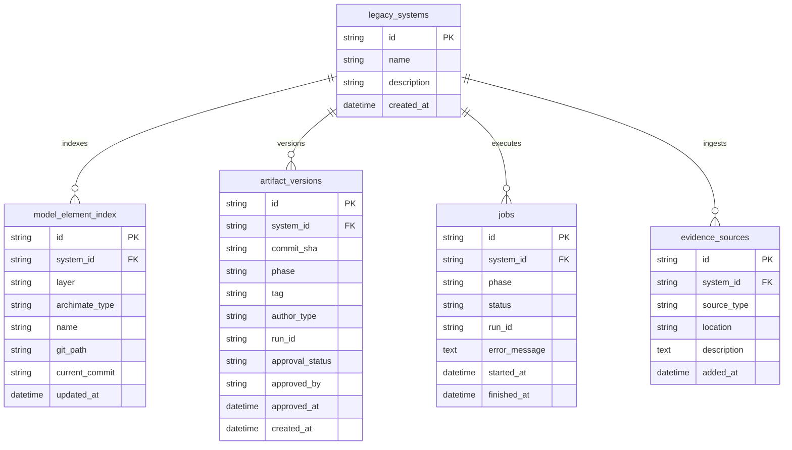

# Database Schema Documentation — MVP (Task B1)

The Phase 1 MVP uses PostgreSQL with 5 core relational tables managed by Alembic migrations.

## Entity Relationship Diagram

## Table Descriptions

1. **`legacy_systems`**: Master registry of legacy software applications.
2. **`model_element_index`**: Lightweight queryable relational index of ArchiMate 3.2 elements stored as JSON in Git.
3. **`artifact_versions`**: Audit trail joining LangSmith trace `run_id` to Git `commit_sha` and human PR `approval_status`.
4. **`jobs`**: Tracks asynchronous background agent runs (`queued`, `running`, `succeeded`, `failed`).
5. **`evidence_sources`**: Ingestion locations for source code, IaC, docs, and interview transcripts.
